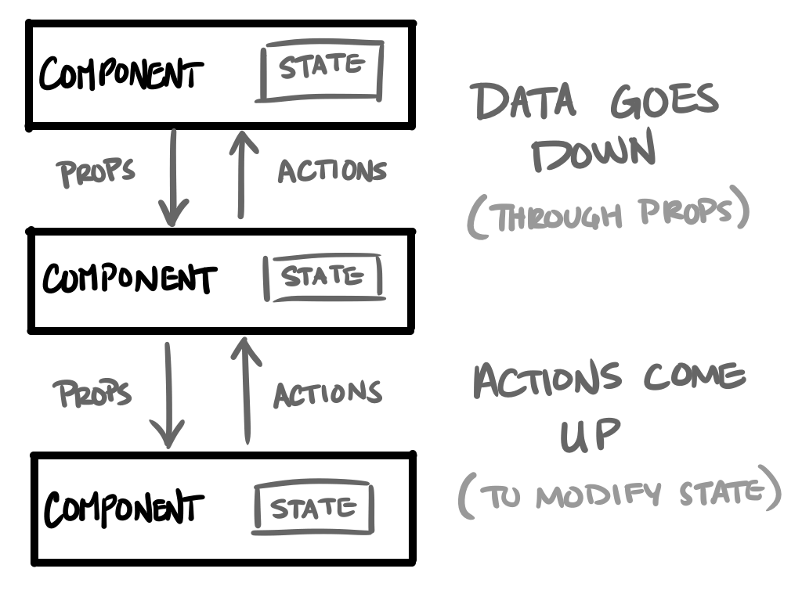
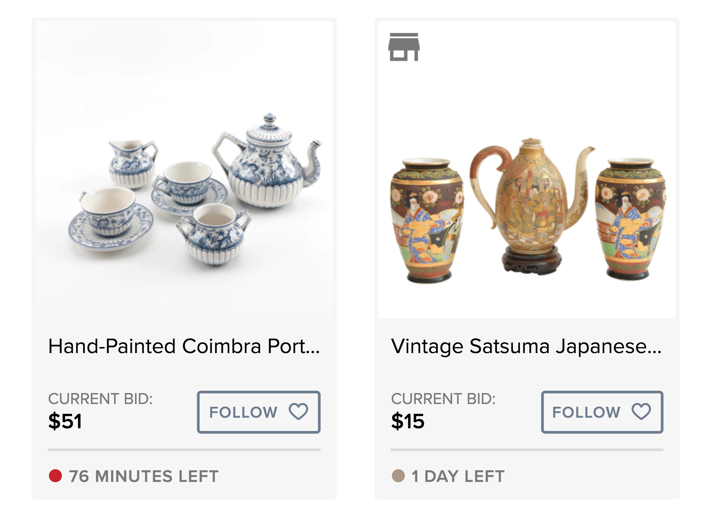
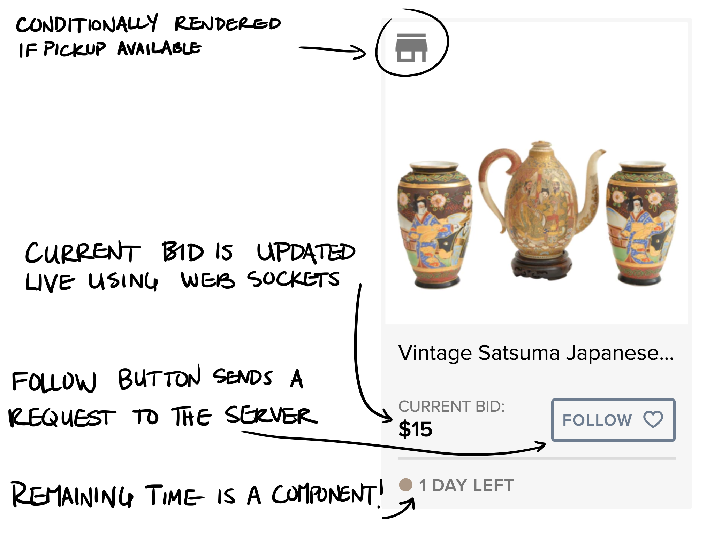
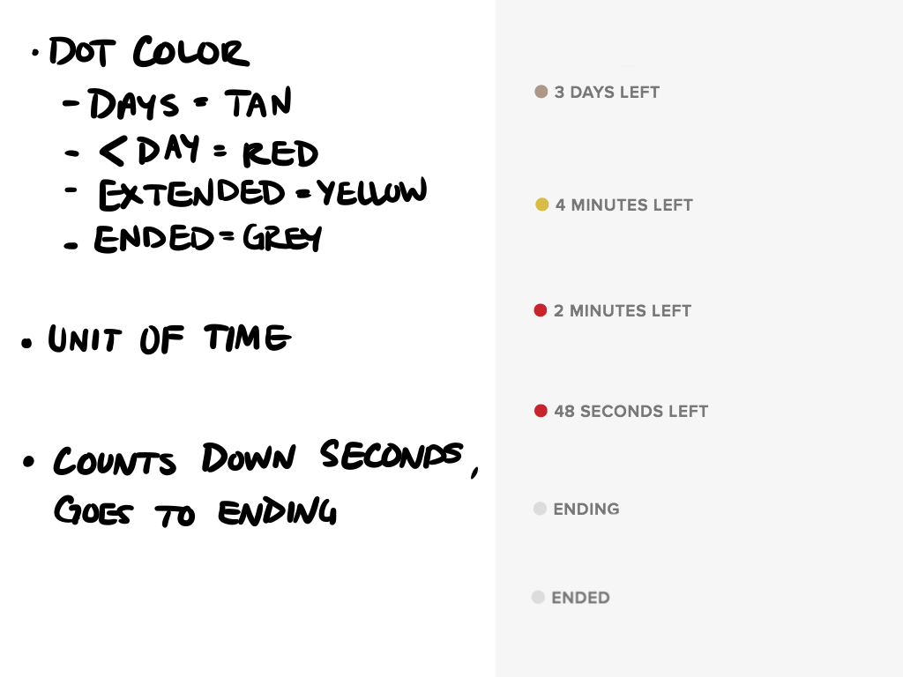

# Intro to React - Summer of JS Series
## Women Who Code Cincinnati

<small>https://github.com/WomenWhoCodeCincy/2018-july-react-intro</small>

<small>Kat Fairbanks</small>
<small>Github - [@katzenbar](https://github.com/katzenbar)</small>
<small>Twitter - [@DerKatzenbar](https://twitter.com/DerKatzenbar)</small>

---

<!-- page_number: true -->
# Before We Get Started...

- This talk is  focused on the *concepts* needed to program in React.
- You do not need to understand every line (or most lines) of the code.
- Understanding the code will come with following tutorials. 

---

# What is React?

> React is a library for building composable user interfaces. It encourages the creation of reusable UI components which present data that changes over time.


— <cite>https://reactjs.org/blog/2013/06/05/why-react.html</cite>

---

# What is React?

- Created by Facebook engineers
- Facebook Ads was a very difficult, high-risk project to maintain and update
- When Instagram was acquired by Facebook, React had to be separated from the Facebook ecosystem. This eventually led to the framework being open-sourced.
- https://stackshare.io/posts/the-react-story

---

# What is React? — Component-Based

> Build encapsulated components that manage their own state, then compose them to make complex UIs.

— <cite>https://reactjs.org</cite>

---

# What is React?

```jsx
class Card extends Component {
  render() {
    return (
      <div className="card">
        <div className="card__header">
          {this.props.header}
        </div>
        <div className="card__content">
          {this.props.content}
        </div>
      </div>
    );
  }
}
```

---

# What is React?

```jsx
class LatestHeadlines extends Component {
  state = [
    { headline: "...", blurb: "..." },
    { headline: "...", blurb: "..." },
  ]
  
  render() {
    return (
      <div className="headlines">
        { state.map(
          (article) => 
            <Card 
              header={article.headline} 
              content={article.blurb} 
            />
        ) }
      </div>
    );
  }
}
```

---

# What is React? — Declarative

> Since component logic is written in JavaScript instead of templates, you can easily pass rich data through your app and keep state out of the DOM.

— <cite>https://reactjs.org</cite>

---

# Templates — The usual story

In most frameworks, normally you would write an HTML file with some template tags.

---

View:
```
{
  "stooges": [
    { "name": "Moe" },
    { "name": "Larry" },
    { "name": "Curly" }
  ]
}
```

Template:
```
{{#stooges}}
<b>{{name}}</b>
{{/stooges}}
```

Output:
```
<b>Moe</b>
<b>Larry</b>
<b>Curly</b>
```

---

# What is React? — Declarative

> Since component logic is written in JavaScript instead of templates, you can easily pass rich data through your app and keep state out of the DOM.

— <cite>https://reactjs.org</cite>

---

# JSX

```jsx
function formatName(user) {
  return user.firstName + ' ' + user.lastName;
}

const user = {
  firstName: 'Harper',
  lastName: 'Perez'
};

const element = (
  <h1>
    Hello, {formatName(user)}!
  </h1>
);

```
---

# JSX

> Instead of artificially **separating technologies** by putting markup and logic in separate files, React **separates concerns** with loosely coupled units called “components” that contain both.

---

# JSX

```jsx
class LatestHeadlines extends Component {
  state = [
    { headline: "...", blurb: "..." },
    { headline: "...", blurb: "..." },
  ]
  
  render() {
    return (
      <div className="headlines">
        { state.map(
          (article) => 
            <Card 
              header={article.headline} 
              content={article.blurb} 
            />
        ) }
      </div>
    );
  }
}
```

---

# JSX — Almost the same as HTML

## `class` ⇒ `className`

HTML
```html
<div class="button"></div>
```

JSX
```jsx
<div className="button" />
```

---

# JSX — Almost the same as HTML

## All tags must be closed in JSX

HTML
```html

```

JSX
```jsx

```
---

# JSX — Almost the same as HTML

*BUT WAIT THERE'S MORE!* 
You can embed Javascript expressions into your HTML with JSX


---

# Quick Detour - Javascript Expressions

*An expression is any valid unit of code that resolves to a value.* [(from MDN)](https://developer.mozilla.org/en-US/docs/Web/JavaScript/Guide/Expressions_and_Operators#Expressions)


**Good**
```js
2 + 12 * 16
```

```js
"Hello"
```

```js
[1, 2, 3].map(x => x * x)
```

**Bad**
```js
var x = "Hello"
```

---

# JSX — Using Expressions

JSX interprets text inside of `{curly brackets}` as Javascript code.

```jsx
function formatName(user) {
  return user.firstName + ' ' + user.lastName;
}

const user = {
  firstName: 'Harper',
  lastName: 'Perez'
};

const element = (
  <h1>
    Hello, {formatName(user)}!
  </h1>
);

```

---

# JSX — Rendering lists

JSX expressions can also be lists.

#### Input
```jsx
const list = ['apples', 'oranges', 'bananas'];

const element = (
  <div>{list}</div>
);
```

#### Result
```
<div>applesorangesbananas</div>
```

---

# JSX — Rendering lists

It is usually more appropriate to return an array of JSX elements (we usually call a JSX element a **Node**).

#### Input
```jsx
const listAsElements = list.map((item) => {
  return <li>{item}</li>;
});

const element = <ul>{listAsElements}</ul>;
```

#### Output
```
<ul>
  <li>apples</li>
  <li>oranges</li>
  <li>bananas</li>
</ul>
```

---

# JSX — Rendering lists

We usually do not compute these lists outside of the templates. It is easier to see the whole picture if you calculate it inline like this.

```jsx
const element = (
  <ul>
    {
      list.map((item) => {
        return <li>{item}</li>;
      })
    }
  </ul>
);
```

---

# JSX — Rendering lists

React expects each Node in a list to have a unique `key` attribute, to help it with rendering efficiently.

```jsx
const element = (
  <ul>
    {
      list.map((item) => {
        return <li key={item}>{item}</li>;
      })
    }
  </ul>
);
```

---

# Getting Back to React

Actually JSX is a large part of understanding how to write simple React code! But there are a few more concepts to learn to cover the basics.


---

# Making JSX Reusable — Components

We organize our JSX templates into something React calls Components.

```jsx
import React, { Component } from 'react';

class HelloWorld extends Component {
  render() {
    return <div>Hello, World!</div>;
  }
}
```

---

# Props — Passing Data into Components

The syntax we use for HTML attributes becomes even more powerful in React. You can not only pass basic data into components, but you can also pass Javascript objects and functions.

```jsx
<li key={item}>{item}</li>
```

---

# Props — Passing Data into Components

Assume we have a `Card` component. We can pass props in like this:

```jsx
const articleContent = """
There is an exciting group of women programming 
right this moment.
""";

<Card 
  heading="Ladies are programming" 
  content={articleContent} 
/>
```

---

# Props — Passing Data into Components

In the `Card` component, props that are passed in can be accessed through `this.props`.

```jsx
class Card extends Component {
  render() {
    return (
      <div className="card">
        <div className="card__header">
          {this.props.header}
        </div>
        <div className="card__content">
          {this.props.content}
        </div>
      </div>
    );
  }
}
```

---

# Props — Passing Data into Components

Functions can be passed into components and elements, to be called by that Node.

```jsx
class Counter extends Component {
  incrementCount = () => {
    console.log("Increment!")
  }
  
  render() {
    return (
      <div>
        <div>Count: {this.props.count}</div>
        <button onClick={this.incrementCount}>
          Increment
        </button>
      </div>
    );
  }
}
```

---

# Props — Immutable

To implement `incrementCount` on the last slide, you might be tempted to try this.

```jsx
class Counter extends Component {
  incrementCount = () => {
    this.props.count += 1;
  }
  ...
}
```

And this might make a change, but it would only be until React renders the DOM again. Props are *immutable*.

---

# State — Mutable Data for Components

Mutating data is necessary to build an interactive application. React lets you do this though something called `state`.

```jsx
class Counter extends Component {
  state = {
    count: 0,
  }
  ...
}
```

---

# State — Mutable Data for Components

So since `state` is mutable, can we do this?

```jsx
class Counter extends Component {
  incrementCount = () => {
    this.state.count += 1
  }
  ...
}
```

Not quite. React wants a message to know that you have updated the state, so it can re-render at the correct time.

---

# State — Mutable Data for Components

State can be modified through a function on the component instance, `this.setState`.

```jsx
class Counter extends Component {
  state = {
    count: 0,
  };

  incrementCount = () => {
    this.setState({
      count: this.state.count + 1,
    });
  }

  ...
}
```

---

# State — Mutable Data for Components

If state is an object, you only have to pass in the keys you want to update.

```jsx
state = {
  count: 0,
  incrementCount: 0,
  decrementCount: 0,
};

incrementCount = () => {
  this.setState({
    count: this.state.count + 1,
    incrementCount: this.state.incrementCount + 1,
  });
}
```

---

# State — A Double-Edged Sword

When building applications, it is a best-practice to keep state in the upper-most components. If you don't, you often end up moving state higher and higher up as needed, or find yourself without access to the data you want.

---

# So how do we change state from the components we use?

---



---

# Actions Up

As an example, let's take the counter button and make it into a component.

```jsx
class Button extends Component {
  render() {
    return (
      <button onClick={this.props.onClick}>
        {this.props.label}
      </button>
    );
  }
}
```

---

# Actions Up

```jsx
class Counter extends Component {
  ...
  render() {
    return (
      <div>
        <div>Count: {this.state.count}</div>
        <Button 
          onClick={this.incrementCount}
          label="Increment" 
        />
      </div>
    );
  }
}
```

---

# A Real-World Example

Let's take a look at how I have been using React at work, and break down why React and Components have been helpful.

---


---



---



---



---


---


---


---

# Next Steps — Recommended Reading

- https://reactjs.org/tutorial/tutorial.html
  - The offical ReactJS tutorial
- http://buildwithreact.com/tutorial
  - A good tutorial that explains these concepts in a really understandable way
- https://egghead.io/courses/the-beginner-s-guide-to-react
  - If you prefer videos, there is free material available through egghead.io.

---

# Next Steps

## Common Libraries

- Redux - https://redux.js.org/
- React Router - https://reacttraining.com/react-router/
- Apollo - https://www.apollographql.com/

## Awesome Tools

- Gatsby - https://www.gatsbyjs.org/
- Storybook - https://storybook.js.org/