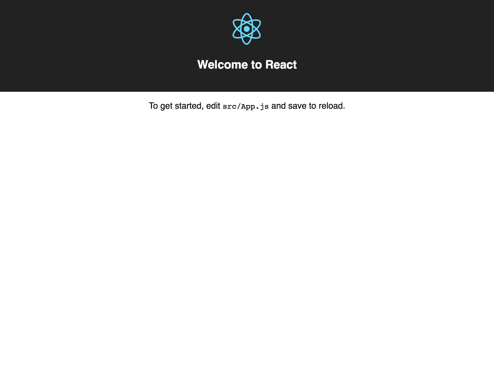

# Step 1 - Setup

To kick off your React adventure, we are going to use the `create-react-app` to launch us straight into writing our React app. In your terminal, `cd` to your development directory (may I suggest `~/dev` if you don't have one already?) and run:

```bash
# Creates a folder called "todomvc-react" filled with the files to run your React app
$ npm init react-app todomvc-react

# Change to the project directory
$ cd todomvc-react

# Start the Webpack server to run the React app
$ npm start
```

You should see the create React app open in your browser. It should look something like this:



Lets look at what files are included. There are a few comments to explain what some of these files are.

```
todomvc-react
│   # Instructions to go along with create-react-app
├── README.md
├── node_modules
├── package.json
├── .gitignore
├── public
│   │   # Static files that go with your app. You should not
│   │   # need to modify any of these files.
│   ├── favicon.ico
│   ├── index.html
│   └── manifest.json
└── src
    │   # The App files are our inital React component.
    ├── App.css
    ├── App.js
    ├── App.test.js
    │   # We will copy the TodoMVC CSS into this file later.
    │   # This is the only css file we need for this project,
    │   # but you may want additional css files in the future.
    ├── index.css
    │   # This file renders the App.js file into the HTML DOM.
    │   # You will not need to edit this file.
    ├── index.js
    ├── logo.svg
    │   # Do not worry about the contents of this file for
    │   # now, but take a look later if you are interested in
    │   # Progressive Web Apps.
    └── registerServiceWorker.js
```

As a final step while your web browser has the project open (http://localhost:3000), edit the text in `src/App.js` from "Welcome to React" to a phrase of your choice. Your changes should appear in the browser automatically without refreshing! This is called "hot-reloading", which is a feature built-into `create-react-app`. It's much nicer than the days where we had to refresh the browser, it was like living in the stone age!

---

### Changes made in Step 1
- All changes: [6514bb3](https://github.com/WomenWhoCodeCincy/2018-july-react-intro/commit/6514bb36a4969ea08222d8f517c9143c0ff575f9) 
