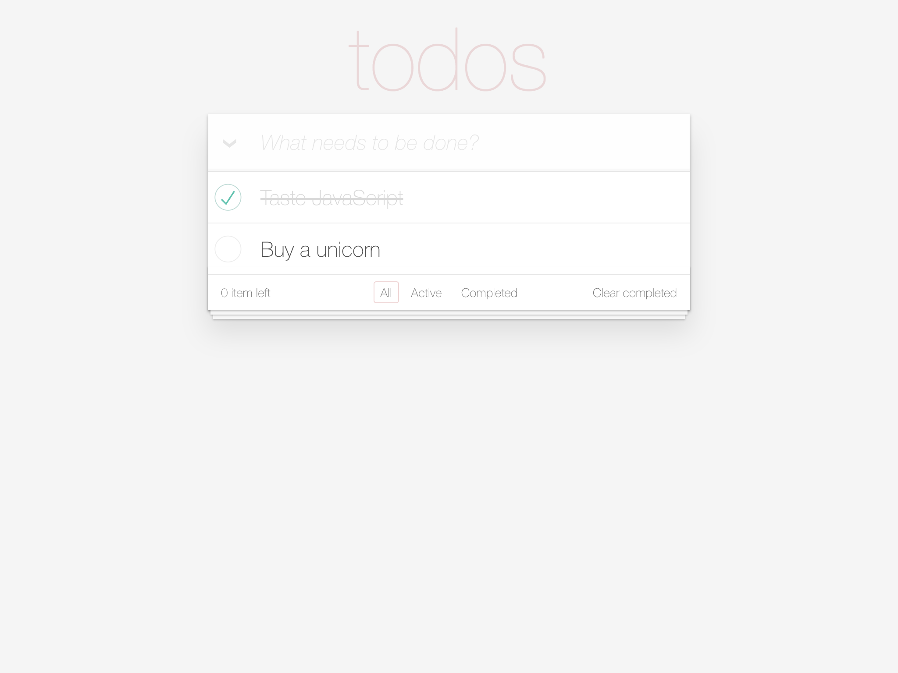

# Step 2 - Displaying Static HTML

- [Part 1 - Removing extra files from `create-react-app`](#part-1)

## Part 1 - Removing extra files from `create-react-app`

In this step, we will add code needed to start our journey to building the TodoMVC app in React and clean up a few files from `create-react-app` that we are not going to use.

First, lets delete a few files:

- `src/App.test.js`
  - Testing is extrememly important, but not something you need to focus on when first learning React.
- `src/App.css`
  - For the TodoMVC app, we are provided a single CSS file which we are going to put in `src/index.css`. This file is unneeded.
  - In future projects, you may want to write CSS that is specific to each Component file. Then it would be useful to have one CSS file per JS file. But it's not something to think about now.
- `src/logo.svg`
  - This is the React logo shown on the starter page. It won't be used in our app.

When you delete these files, the `npm start` command is going to show an error! It should look something like this:

```bash
Failed to compile.

./src/App.css
Module build failed: Error: ENOENT: no such file or directory, open '/Users/ktornwall/dev/react-intro-2018/src/App.css'
```

This is because there was a reference to the `App.css` file and `logo.svg` file in our `src/App.js` file. Lets fix that. You need to delete 3 different lines from this file, marked by comments below.

#### `src/App.js`

```jsx
import React, { Component } from 'react';
// DELETE LOGO IMPORT
import logo from './logo.svg';
// DELETE APP.CSS IMPORT 
import './App.css';

class App extends Component {
  render() {
    return (
      <div className="App">
        <header className="App-header">
          {
            // DELETE IMG TAG 
          }
          
          <h1 className="App-title">Welcome to React</h1>
        </header>
        <p className="App-intro">
          To get started, edit <code>src/App.js</code> and save to reload.
        </p>
      </div>
    );
  }
}

export default App;
```

After deleting those three lines, you should be back to compiling successfully again.

## Part 2 - Adding TodoMVC assests

Now we are going to get started working with TodoMVC. First, copy the CSS for the app to replace the contents of `src/index.css`. You can find the CSS file here: https://raw.githubusercontent.com/tastejs/todomvc-app-css/master/index.css

As a small finishing touch, replace `public/favicon.ico` with the TodoMVC favicon found here: https://raw.githubusercontent.com/tastejs/todomvc/1.3.0/site-assets/favicon.ico
You can right click on the image and use "Save as..." to replace the icon. You may need to hard-refresh your browser to see the icon change. If you have trouble getting it to change, don't fret. It will be correct when you deploy the app.

## Part 3 - Putting the static HTML into our app

The final step is to get the basic TodoMVC HTML into the application. My favorite way to develop React apps is to write static HTML and focus on what I want my app to look like, and then convert that static HTML into interactive React components.

The HTML comes from the todomvc-app-template that you can find here:
https://github.com/tastejs/todomvc-app-template/blob/master/index.html I have taken the `section` with the todo app content, and put it into the `src/App.js`'s render method. It takes a bit of editing to create proper JSX from plain HTML, so it is probably best to copy the resulting file:

#### `src/App.js`

```jsx
import React, { Component } from 'react';

class App extends Component {
  render() {
    return (
      <section className="todoapp">
        <header className="header">
          <h1>todos</h1>
          <input className="new-todo" placeholder="What needs to be done?" autoFocus />
        </header>

        {/* This section should be hidden by default and shown when there are todos */}
        <section className="main">
          <input id="toggle-all" className="toggle-all" type="checkbox" />
          <label htmlFor="toggle-all">Mark all as complete</label>

          <ul className="todo-list">
            {/* These are here just to show the structure of the list items */}
            {/* List items should get the class `editing` when editing and `completed` when marked as completed */}
            <li className="completed">
              <div className="view">
                <input className="toggle" type="checkbox" checked />
                <label>Taste JavaScript</label>
                <button className="destroy"></button>
              </div>

              <input className="edit" value="Create a TodoMVC template" />
            </li>

            <li>
              <div className="view">
                <input className="toggle" type="checkbox" />
                <label>Buy a unicorn</label>
                <button className="destroy"></button>
              </div>
              <input className="edit" value="Rule the web" />
            </li>
          </ul>
        </section>

        {/* This footer should hidden by default and shown when there are todos */}
        <footer className="footer">
          {/* This should be `0 items left` by default */}
          <span className="todo-count"><strong>0</strong> item left</span>

          {/* Remove this if you don't implement routing */}
          <ul className="filters">
            <li>
              <a className="selected" href="#/">All</a>
            </li>
            <li>
              <a href="#/active">Active</a>
            </li>
            <li>
              <a href="#/completed">Completed</a>
            </li>
          </ul>

          {/* Hidden if no completed items are left ↓ */}
          <button className="clear-completed">Clear completed</button>
        </footer>
      </section>
    );
  }
}

export default App;
```

So that you can adapt plain HTML in the future, here are the changes that I had to make this into JSX.

- Attributes with slightly different names
  - There are three different attributes in this example where JSX uses a different name. First, all attributes must be written in camelCase. Second, attributes that are a reserved word in Javascript have a slightly different name. Read more about this in the React documentation here: https://reactjs.org/docs/dom-elements.html
  - `autofocus` is changed to be written in camelCase => `autoFocus`
  - `class` is a reserved word for making classes in Javascript => `className`
  - `for` is a reserved word used to make loops in Javascript => `htmlFor`
- All tags must be closed in JSX
  - In standard HTML, you are not expected to close tags like `` or `<input>`, they cannot have child elements and are considered to be "self-closing" or "empty elements" https://developer.mozilla.org/en-US/docs/Glossary/empty_element
  - in JSX, all elements must be closed. It is standard to close elements without children by adding a slash to the end of the tag like `<div />` or `<input />`. https://reactjs.org/docs/introducing-jsx.html#specifying-children-with-jsx
- HTML comments are not supported in JSX
  - Standard HTML comments are written as `<!-- A comment -->`
  - JSX comments are written as Javascript expressions like `{/* A comment */}`
  - Typically HTML comments

After you are done with this step, the app should look like this:



---

### Changes made in Step 2
- [All Changes](https://github.com/WomenWhoCodeCincy/2018-july-react-intro/compare/before-2...after-2) 
- Part 1: [8dfc2f3](https://github.com/WomenWhoCodeCincy/2018-july-react-intro/commit/8dfc2f33c71e13821cd806cdb24e66cdf1fa7831)
- Part 2: [a1d1423](https://github.com/WomenWhoCodeCincy/2018-july-react-intro/commit/a1d1423f42399deb7e1fead0ecec395ab655f292)
- Part 3: [a839173](https://github.com/WomenWhoCodeCincy/2018-july-react-intro/commit/a839173ff7c617b68bb7803649b204dfea9b6a15)
