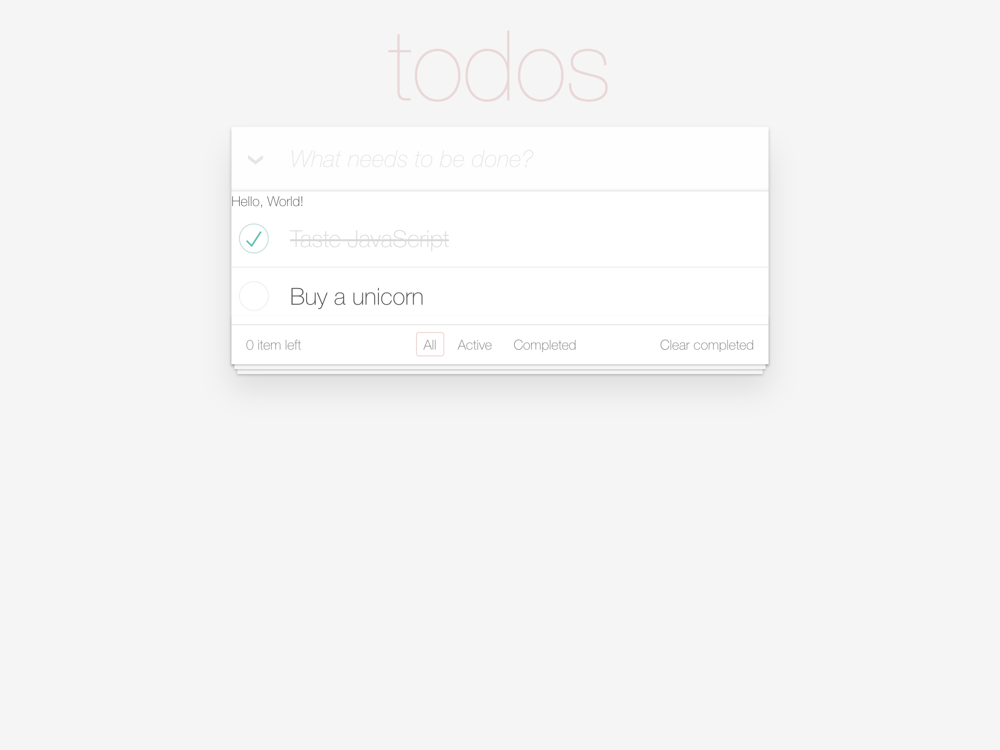
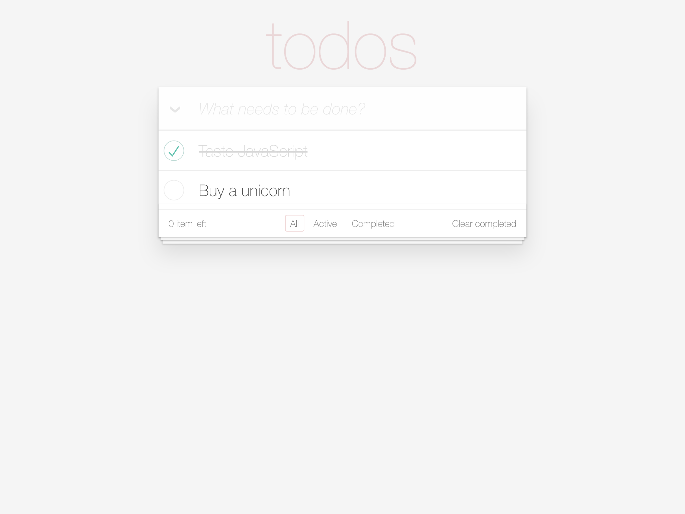
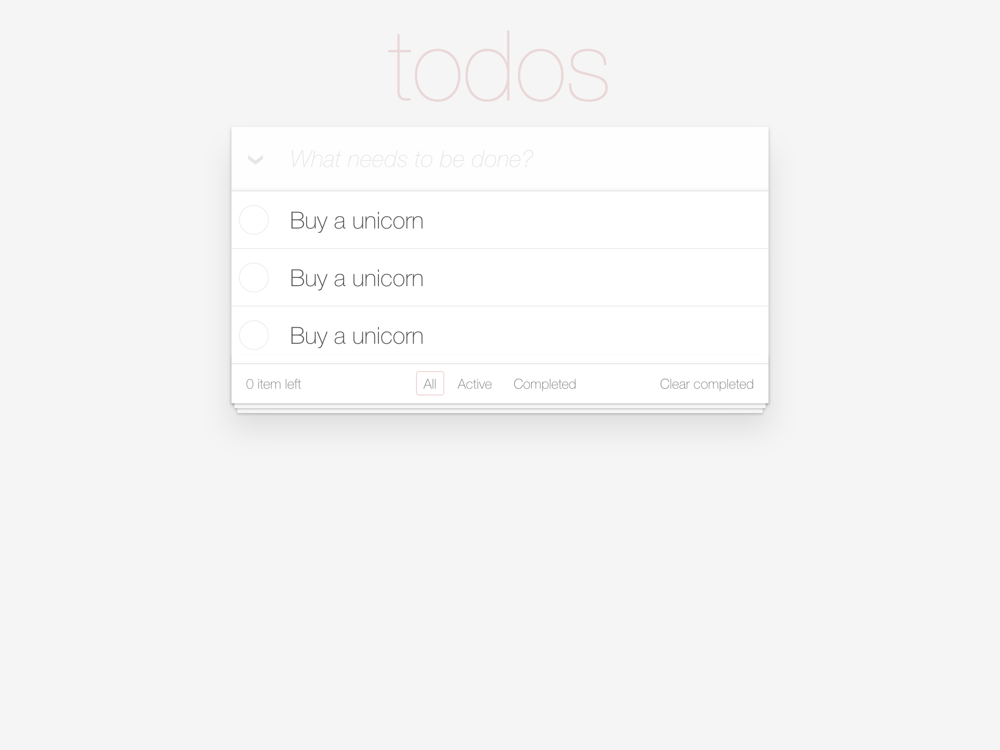
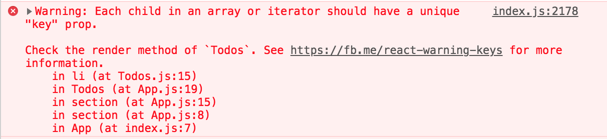
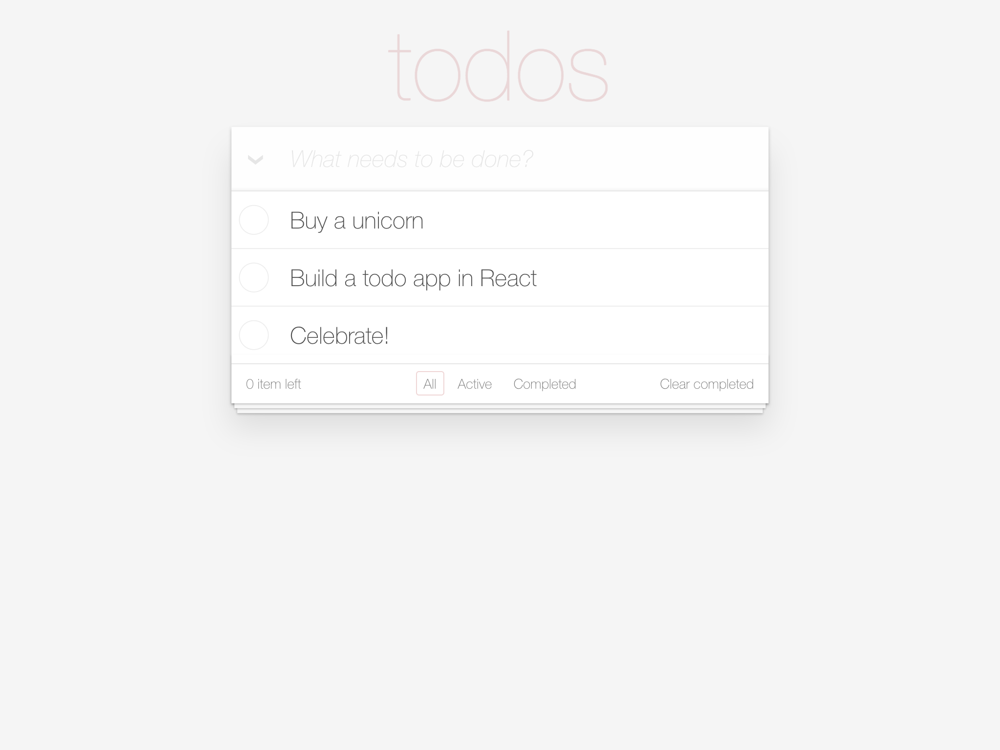

# Step 3 - Rendering a list of Todos

- [Part 1 - Building our first component](#part-1---building-our-first-component)
- [Part 2 - Using the component](#part-2---using-the-component)
- [Part 3 - Moving the HTML into our component](#part-3---moving-the-html-into-our-component))
- [Part 4 - Rendering a list](#part-4---rendering-a-list)
- [Part 5 - The key prop](#part-5---the-key-prop)
- [Part 6 - Rendering Todo text](#part-6---rendering-todo-text)

## Part 1 - Building our first component

Before we start rendering a list of Todos, I want to pull out the todos into a component. This will help us focus on just this list when making our changes. To do this, we'll need to create our first component!

Create a file named `/src/Todos.js`, and add the following code.

#### `/src/Todos.js`

```jsx
import React, { Component } from 'react';

class Todos extends Component {
  render() {
    return (
      <div>
        Hello, World!
      </div>
    );
  }
}

export default Todos;

```

Let's break this down line by line.

### The import statement

```jsx
import React, { Component } from 'react';
```

This is ES6 syntax for importing code from another module. If you are familiar with Node.js, this is like a `require` statement. `create-react-app` already installed the `react` module for us from [NPM](https://www.npmjs.com/), so we can reference it by name.

The first import references `React`. Imports outside of curly brackets (these guys `{}`) give a reference to the default export of a module. In most cases, we can use whatever variable name we want here. But to use JSX, it is required that we have the React module in scope with the name `React`. Try renaming `React` in `src/App.js`, and you will see compiler errors.

The next import statement references `Component`. Things imported inside of curly brackets are named exports of the module. As this might imply, the name we use here must match the name that `react` exported. In this case, `Component` is a named export that is equal to `React.Component` that is provided for convenience. You will see most React developers use this import over the `React.Component` alternative.

### Defining the class

```jsx
class Todos extends Component {
  ...
}
```

The next code you see is the class definition. There are a few different ways to define React components, but the most basic way (and only way we will cover in this tutorial) is to make an ES6 class that extends `Component`. Here we have named our component `Todos`.

### The render function

```jsx
render() {
  return (
    <div>
      Hello, World!
    </div>
  );
}
```

Every React component must have a `render` function defined. Every `render` function is also expected to return `null`, a JSX fragment, or a Javascript string (like `"Hi!"`). To see what happens when you don't define a `render` function, rename `render` in `src/App.js` to `render1`. You should see this error in your browser:

```
TypeError: instance.render is not a function
```

To keep my app compiling as I develop, when I first create a component I return a simple placeholder `div` until I am ready to code.

### Exporting the component

```jsx
export default Todos;
```

The last statement in this file is exporting the component. We talked about how the `react` module has a default export, and this is the same thing! Each file in your app acts like its own little module, and this is how we declare a default export of our `Todos` class.

Alternatively, you may see a more compact syntax that has the export on the same line as the class declaration like this:

```jsx
export default class Todos extends Component {
  ...
}
```

This does exactly the same thing, and there is no significant benefit of using one version over the other. As a matter of habit and personal taste, I always use the separate export statement and that is what you will see in this tutorial.

[**Changes for Part 1** (dc98b65)](https://githb.com/WomenWhoCodeCincy/2018-july-react-intro/commit/dc98b650672b0e2f73d8f2b64c5517fbf79ccd3f)

## Part 2 - Using the component

Now, we have a component for just the list, but we need to use it in our app to be able to see our changes. To start, open up `/src/App.js` and import our component:

#### `/src/App.js`

```jsx
import React, { Component } from 'react';

import Todos from './Todos';

class App extends Component {
...
```

The `./` at the beginning of the import path denotes that we want to reference a local file instead of an installed module like `react`. Specifying the file extension is not required when importing local modules, Webpack will infer it for you.

Now that we have our component in scope, we will add it to the rendered content of the App component.

#### `/src/App.js`

```jsx
<section className="main">
  <input id="toggle-all" className="toggle-all" type="checkbox" />
  <label htmlFor="toggle-all">Mark all as complete</label>

  <Todos />
  <ul className="todo-list">
...
```

React components are used just like HTML tags. The way you can tell a React component apart from an HTML tag is that React components must start with a capital letter, otherwise JSX will not render your app correctly. You can read a little more about this here: https://reactjs.org/docs/jsx-in-depth.html#user-defined-components-must-be-capitalized

After putting the `Todos` component in our app, you should see the "Hello, world!" text right above the list of todos. After this step, your app should look like this:



[**Changes for Part 2** (e10f662)](https://github.com/WomenWhoCodeCincy/2018-july-react-intro/commit/e10f662f3f7215c18f8563747463aaa8830de739)

## Part 3 - Moving the HTML into our component

While it's awesome that we have our own component in the app, it should probably do something more useful. You might have guessed by the name of the component, it is intended to render the list of todos.

One of my favorite ways to refactor out a component in a static mockup is to make it look like nothing changed. This helps me make small, incremental changes, and makes it a bit easier to notice what change is causing an issue. With that in mind, we will move the `<ul>` list from App.js to Todos.js.

Moving the todo list to Todos.js...

#### `/src/Todos.js`

```jsx
class Todos extends Component {
  render() {
    return (
      <ul className="todo-list">
        {/* These are here just to show the structure of the list items */}
        {/* List items should get the class `editing` when editing and `completed` when marked as completed */}
        <li className="completed">
          <div className="view">
            <input className="toggle" type="checkbox" checked />
            <label>Taste JavaScript</label>
            <button className="destroy"></button>
          </div>

          <input className="edit" value="Create a TodoMVC template" />
        </li>

        <li>
          <div className="view">
            <input className="toggle" type="checkbox" />
            <label>Buy a unicorn</label>
            <button className="destroy"></button>
          </div>
          <input className="edit" value="Rule the web" />
        </li>
      </ul>
    );
  }
}
```

And removing them from App.js...

#### `/src/App.js`

```jsx
<section className="main">
  <input id="toggle-all" className="toggle-all" type="checkbox" />
  <label htmlFor="toggle-all">Mark all as complete</label>

  <Todos />
</section>
```

Which should result in something that looks like this:



We're back to where we started... but I promise this is great progress! We are set up for success in rendering the list from here.

[**Changes for Part 3** (12d29a9)](https://github.com/WomenWhoCodeCincy/2018-july-react-intro/commit/12d29a96ae28618db1d1ef951fcab1b3e645631f)

## Part 4 - Rendering a list

Now we can just focus on the Todos.js file for a little bit. It's just static HTML at the moment. It would be nice if we could dynamically render the list of todos based on some Javascript data. Let's tackle that next.

To get started with rendering based off of data, especially data we do not have yet, it is often easiest to start with a constant. This lets us work with data without worrying about where we are getting it from and how it is coming into the component. We can add it straight into the render function like this:

#### `/src/Todos.js`

```jsx
render() {
  const todos = [
    {},
    {},
    {},
  ];

  return (
    ...
```

This gives us an array of objects to work with. `const` is new ES6 syntax for a `var` that cannot be reassigned [(see MDN)](https://developer.mozilla.org/en-US/docs/Web/JavaScript/Reference/Statements/const). It might strike you as odd that all of these objects are empty. We only want to focus on rendering a list, not details of the model we want to use for our todos, so they will get fleshed out as we go on.

Now that we have an array, let's see how to render it. Similar to how we return a JSX Node from our `render` functions, we can also return an array of Nodes to render. This array can be a value of our JSX expression inside of curly brackets. To turn an array of objects into an array of nodes, we will use the `map` function like this:

```jsx
array.map((message) => <div>{text}</div>)
```

Understanding how the `map` function works is essential to being proficient in React, as it is the main way we render lists to the DOM. If you want to learn more, please [see MDN here](https://developer.mozilla.org/en-US/docs/Web/JavaScript/Reference/Global_Objects/Array/map).

In our case, we will want to map over one of the mocked up todos to render them like a list. It should look something like this:

#### `/src/Todos.js`

```jsx
class Todos extends Component {
  render() {
    const todos = [
      {},
      {},
      {},
    ];

    return (
      <ul className="todo-list">
        {
          todos.map((todo) => (
            <li>
              <div className="view">
                <input className="toggle" type="checkbox" />
                <label>Buy a unicorn</label>
                <button className="destroy"></button>
              </div>
              <input className="edit" value="Rule the web" />
            </li>
          ))
        }
      </ul>
    );
  }
}
```

If you want to prove to yourself that we are rendering the list passed in, change how many objects are in the array and watch the page change. Pretty cool! With three objects, your app should look like this:



[**Changes for Part 4** (23abc8b)](https://github.com/WomenWhoCodeCincy/2018-july-react-intro/commit/23abc8beab5a9612b393b701c0cc0baa21c77f56)

## Part 5 - The `key` prop

There is one small addition we need to make to our list rendering code. If you open your developer console (Google "View developer console" with the name of your browser to find how to open it), you will see this error in our application (along with others, but this is our focus for now):



I would recommend that you always keep your console open when working with Javascript in the browser. React provides a lot of helpful error messages to guide you while coding, and it would be a shame to miss out on them. It's a good way to catch subtle issues early.

Back to the error itself. When rendering a list of Nodes from an array, each Node in that array *must have* an attribute `key` passed in. Furthermore, each value of `key` in the array *must be unique*. The `key` value helps React identify objects in arrays as they are reordered and modified.

The first guess many people take, and often the fallback for lazy React developers, is to use the array index. 

```jsx
todos.map((todo, index) => (
  <li key={index}>
    ...
  </li>
))
```

That's definitely a unique value, but it does not help us identify elements as they are reordered, removed, or added in between. You can read more in depth about this issue [here](https://medium.com/@robinpokorny/index-as-a-key-is-an-anti-pattern-e0349aece318) if you are interested. But for now, it looks like we need to have some kind of unique data on each of our todos.

One idea could be to use the message of the todo, but that does not work if I am tracking daily chores that have repeating todos every day. A simple idea is to add an auto-incrementing id, like you see in databases. That is what we will use here.

You will want to add unique ids to each object, and then add the `key` prop to the `<li>` Node. The resulting code looks like this:

#### `/src/Todos.js`

```jsx
class Todos extends Component {
  render() {
    const todos = [
      { id: 1 },
      { id: 2 },
      { id: 3 },
    ];

    return (
      <ul className="todo-list">
        {
          todos.map((todo) => (
            <li key={todo.id}>
              <div className="view">
                <input className="toggle" type="checkbox" />
                <label>Buy a unicorn</label>
                <button className="destroy"></button>
              </div>
              <input className="edit" value="Rule the web" />
            </li>
          ))
        }
      </ul>
    );
  }
}
```

This gives us a value that uniquely identifies each object, and will stand up to us deleting and adding todos.

[**Changes for Part 5** (263072e)](https://github.com/WomenWhoCodeCincy/2018-july-react-intro/commit/263072e662824924c46956a7fc4fa19246225ca6)

## Part 6 - Rendering Todo text

Now that we are rendering lists of todos, lets customize the text shown for each todo so we can tell them apart. We'll start with modifying our todo objects:

#### `/src/Todos.js`

```jsx
const todos = [
  {
    id: 1,
    message: "Buy a unicorn",
  },
  {
    id: 2,
    message: "Build a todo app in React",
  },
  {
    id: 3,
    message: "Celebrate!",
  },
];
```

Then update the "Buy a unicorn" text in the `<li>` node, and replace it with our todo messages:

```jsx
<label>{todo.message}</label>
```

With these simple changes, we have added pretty significant functionality. Hopefully that makes the subtle changes from before feel more powerful. 

If you are following along at home, your app should look like this now.



[**Changes for Part 6** (5e94ad9)](https://github.com/WomenWhoCodeCincy/2018-july-react-intro/commit/5e94ad9a106359a23e3044ef426547be0162a58b)

## Part 7 - Rendering Todo completion state

## Part 8 - Making a Todo component
